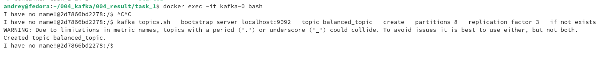
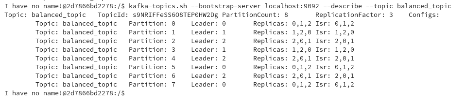
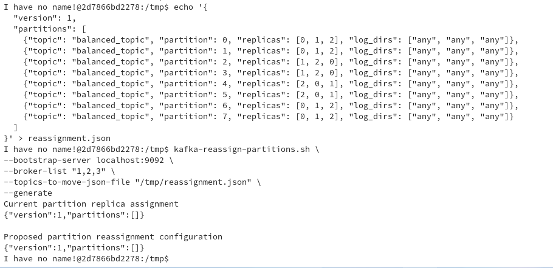
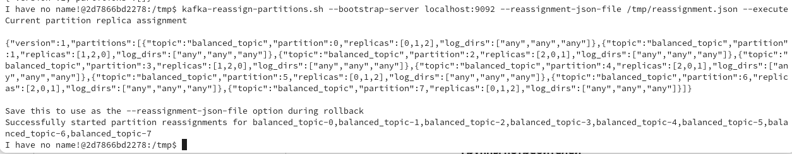
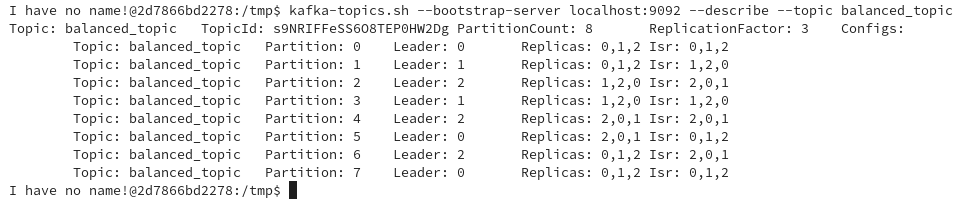
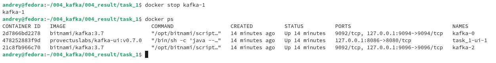
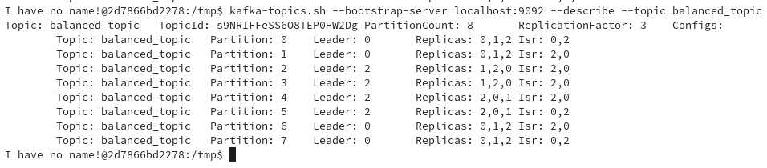
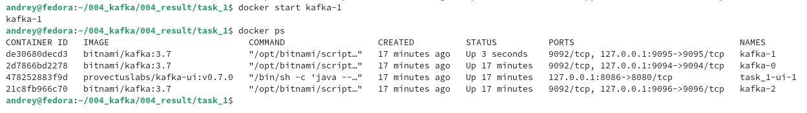
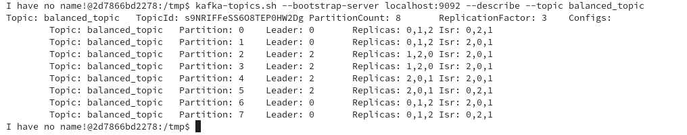
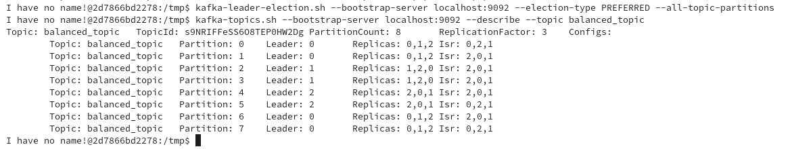

# Kafka Самостоятельная работа №4
## Задание 1. Балансировка партиций и диагностика кластера

### 1) Запуск проекта и перераспределение партиций:
#### В дирректории `/kafka_hw4/task_1` запускаем проект командой:
```
docker compose up -d
```
### 1.1) Заходим в терминал брокера `kafka-0` с помощью команды:
```
docker exec -it kafka-0 bash
```
### 1.2) Создаем топик `balanced_topic` с 8 партициями и фактором репликации 3 командой:
```
kafka-topics.sh --bootstrap-server localhost:9092 --topic balanced_topic --create --partitions 8 --replication-factor 3 --if-not-exists
```
#### Результат:

### 1.3) Получаем подробную информацию о топике `balanced_topic` командой:
```
kafka-topics.sh --bootstrap-server localhost:9092 --describe --topic balanced_topic
```
#### Результат запроса:

### 1.4) В дирректории `tmp` создадим файл reassignment.json  командой:
```
echo '{
  "version": 1,
  "partitions": [
    {"topic": "balanced_topic", "partition": 0, "replicas": [0, 1, 2], "log_dirs": ["any", "any", "any"]},
    {"topic": "balanced_topic", "partition": 1, "replicas": [0, 1, 2], "log_dirs": ["any", "any", "any"]},
    {"topic": "balanced_topic", "partition": 2, "replicas": [1, 2, 0], "log_dirs": ["any", "any", "any"]},
    {"topic": "balanced_topic", "partition": 3, "replicas": [1, 2, 0], "log_dirs": ["any", "any", "any"]},
    {"topic": "balanced_topic", "partition": 4, "replicas": [2, 0, 1], "log_dirs": ["any", "any", "any"]},
    {"topic": "balanced_topic", "partition": 5, "replicas": [2, 0, 1], "log_dirs": ["any", "any", "any"]},
    {"topic": "balanced_topic", "partition": 6, "replicas": [0, 1, 2], "log_dirs": ["any", "any", "any"]},
    {"topic": "balanced_topic", "partition": 7, "replicas": [0, 1, 2], "log_dirs": ["any", "any", "any"]}
  ]
}' > reassignment.json
```
### 1.5) Воспользуемся инструментом переназначения разделов `kafka-reassign-partitions` выполнив команду:
```
kafka-reassign-partitions.sh \
--bootstrap-server localhost:9092 \
--broker-list "1,2,3" \
--topics-to-move-json-file "/tmp/reassignment.json" \
--generate
```
#### Результатом выполнения команд будет план переназначения разделов:

### 1.6) Реализуем план переназначения разделов командой:
```
kafka-reassign-partitions.sh --bootstrap-server localhost:9092 --reassignment-json-file /tmp/reassignment.json --execute
```
#### Результат запроса:

### 1.7) Получаем подробную информацию о топике `balanced_topic` командой:
```
kafka-topics.sh --bootstrap-server localhost:9092 --describe --topic balanced_topic
```
#### Результат запроса:


### 2) Моделирование сбоя брокера:
### 2.1) Останавливаем брокер `kafka-1` командой:
```
docker stop kafka-1
```
#### Выполним команду:
```
docker ps
```
#### Результат запроса:

### 2.2) Получаем подробную информацию о топике `balanced_topic` командой:
```
kafka-topics.sh --bootstrap-server localhost:9092 --describe --topic balanced_topic
```
#### Результат запроса:

### 2.3) Запускаем брокер `kafka-1` командой:
```
docker start kafka-1
```
#### Выполним команду:
```
docker ps
```
#### Результат запроса:

### 2.4) Получаем подробную информацию о топике `balanced_topic` командой:
```
kafka-topics.sh --bootstrap-server localhost:9092 --describe --topic balanced_topic
```
#### Результат запроса:

#### В ответе видно, что брокер `kafka-1` не используется как лидер.
### 2.5) Запускаем выбор предпочтительного лидера для всех топиков командой:
```
kafka-leader-election.sh --bootstrap-server localhost:9092 --election-type PREFERRED --all-topic-partitions
```
### 2.6) Получаем подробную информацию о топике `balanced_topic` командой:
```
kafka-topics.sh --bootstrap-server localhost:9092 --describe --topic balanced_topic
```
#### Результат запроса:

